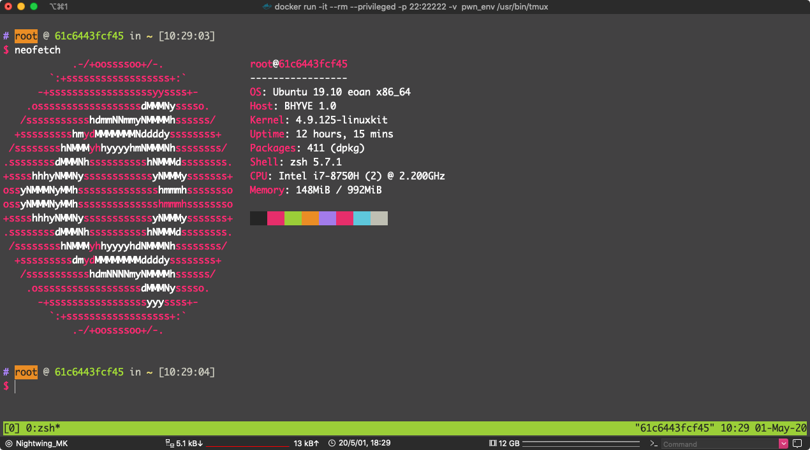
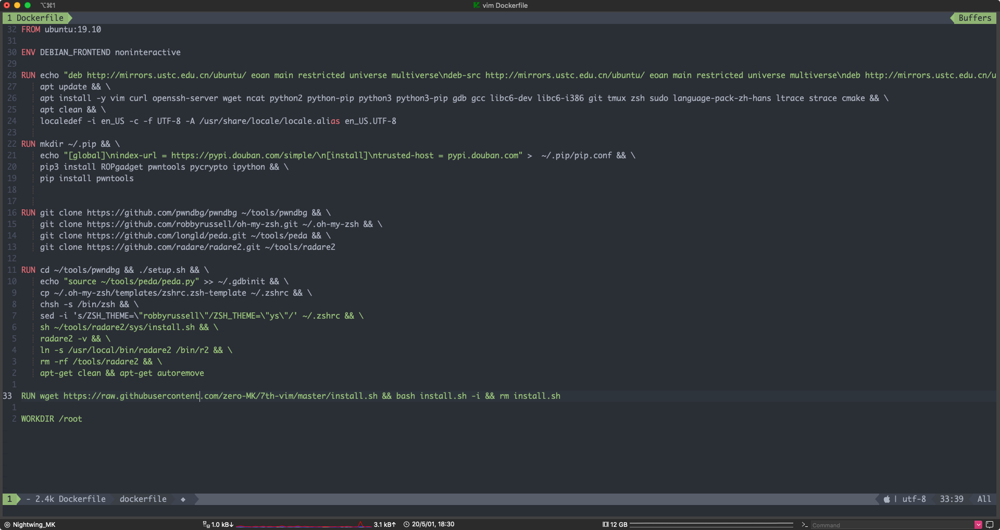

系统： ubuntu:19.10

源：中科大

```
deb http://mirrors.ustc.edu.cn/ubuntu/ eoan main restricted universe multiverse
deb-src http://mirrors.ustc.edu.cn/ubuntu/ eoan main restricted universe multiverse
deb http://mirrors.ustc.edu.cn/ubuntu/ eoan-updates main restricted universe multiverse
deb-src http://mirrors.ustc.edu.cn/ubuntu/ eoan-updates main restricted universe multiverse
deb http://mirrors.ustc.edu.cn/ubuntu/ eoan-backports main restricted universe multiverse
deb-src http://mirrors.ustc.edu.cn/ubuntu/ eoan-backports main restricted universe multiverse
deb http://mirrors.ustc.edu.cn/ubuntu/ eoan-security main restricted universe multiverse
deb-src http://mirrors.ustc.edu.cn/ubuntu/ eoan-security main restricted universe multiverse
deb http://mirrors.ustc.edu.cn/ubuntu/ eoan-proposed main restricted universe multiverse
deb-src http://mirrors.ustc.edu.cn/ubuntu/ eoan-proposed main restricted universe multiverse
```

默认从 apt 源安装：

- vim
- curl
- openssh-server
- wget
- ncat
- python2
- python-pip
- python3
- python3-pip
- gdb
- gcc
- libc6-dev
- libc6-i386
- git
- tmux
- zsh
- sudo
- language-pack-zh-hans
- ltrace
- strace
- cmake


pip源：豆瓣

```
[global]
index-url = https://pypi.douban.com/simple/
[install]
trusted-host = pypi.douban.com
```

pip 默认安装：

- ROPgadget
- pwntools
- pycrypt
-  ipython

以及他们的依赖（我懒得看以及列出来）


gdb以及它的插件

- pwndb

- peda


radare 我是从源码构建：

```bash
git clone https://github.com/radare/radare2.git ~/tools/radare2
sh ~/tools/radare2/sys/install.sh
ln -s /usr/local/bin/radare2 /bin/r2
rm -rf /tools/radare2
```

省缺 `--prefix=` 是  `/usr/local` 

因为 apt 源里面的 radare 版本太旧了没有 decompilers


还有就是定制 vim，这套方案是我从 7th-vim fork并修改的

```bash
wget https://raw.githubusercontent.com/zero-MK/7th-vim/master/install.sh && bash install.sh -i
```


构建：

```bash
git clone https://github.com/zero-MK/pwn_env.git
cd pwn_env
docker build -t pwn_env .
```

或者拉取我构建好的（位于 docker hub上 ）

```base
docker pull 1565328054/pwn_env
```

我没有考虑很多影响体积的因素，反正就是随便叠的（好像是 10 层 layer）

我把 apt 安装和 pip 安装 和 git clone 分开

因为 apt 和 pip 用的是国内的源，比较稳定

git clone 的全是 github 上的东西不挂梯子的话万一中断就要从头构建，分开的话就算是在这一层中断了，挂好梯子再次构建，有能继续从这一层继续构建，而不用重新再用 apt 从头安装一次

基础镜像（ubuntu:19.01） 76MB 

这个体积（pwn_env） 1.62GB




运行：

tmux：

```bash
docker run -it --rm --privileged pwn_env /usr/bin/tmux
```

zsh:

```bash
docker run -it --rm --privileged pwn_env /usr/bin/zsh
```

bash:

```bash
docker run -it --rm --privileged pwn_env /usr/bin/bash
```

看你自己喜欢吧

--rm 是 退出是自动清理

--privileged 不加这个 gdb 没办法调试，具体描述自己 docker run --help